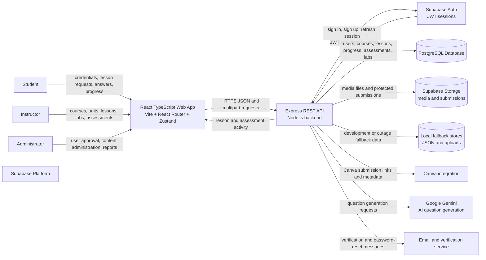

# Interactive Learning System Data Flow Diagram

This document describes how data moves through the Interactive Learning System. It reflects the implemented React frontend, Express backend routes, Supabase services, local fallback stores, file processing, and external integrations.

## System Context Diagram

## Level 1 Data Flow Diagram

```mermaid
flowchart TB
    %% Actors and client
    Student[Student]
    Instructor[Instructor]
    Admin[Administrator]
    UI[React web application\nrole-based dashboards and forms]
    AuthStore[Zustand auth state\naccess and refresh tokens]

    %% API boundary
    Gateway[Express API gateway\nCORS, security headers, rate limits, JSON/multipart parsing]
    JWT[JWT authentication and role middleware]
    Controllers[Route controllers\nand business logic]
    Processor[File and lesson processor\nPDF, PPT/PPTX, DOCX, text, images]
    Scoring[Assessment scoring\nanswers, points, feedback]
    Analytics[Progress and dashboard aggregations]

    %% Data services
    SupabaseAuth[Supabase Auth]
    PostgreSQL[(Supabase PostgreSQL)]
    SupabaseStorage[(Supabase Storage)]
    FallbackStores[(Local JSON stores\nunits, lessons, assessments, users)]
    Uploads[(Backend uploads directory)]

    %% External services
    Canva[Canva]
    Gemini[Google Gemini API]
    Mail[Email verification and reset provider]

    %% Users to UI
    Student -->|login, browse, view, submit, complete| UI
    Instructor -->|manage courses, units, lessons, labs, assessments| UI
    Admin -->|approve users and manage system data| UI
    UI <-->|session state and protected requests| AuthStore
    UI -->|REST requests and file uploads| Gateway
    Gateway --> JWT
    JWT -->|valid JWT and role| Controllers
    JWT -->|login and token validation| SupabaseAuth
    SupabaseAuth -->|session tokens and identity| JWT

    %% Content management
    Controllers -->|create and read courses, units, lessons| PostgreSQL
    Controllers -->|create and read assessments and laboratories| PostgreSQL
    Controllers -->|write and query users, roles, assignments| PostgreSQL
    Controllers -->|fallback reads and writes when configured| FallbackStores
    Instructor -->|PDF, PPT, DOCX, text, image upload| UI
    Gateway --> Processor
    Processor -->|extract text, build slides, create previews| PostgreSQL
    Processor -->|store original and generated files| SupabaseStorage
    Processor -->|development fallback files| Uploads
    Controllers -->|media URLs and lesson metadata| UI

    %% Student learning
    Student -->|open lesson and record time| UI
    UI -->|lesson and unit requests| Gateway
    Controllers -->|published content and targeting rules| PostgreSQL
    PostgreSQL -->|lesson content, media URLs, unit structure| Controllers
    Controllers -->|lesson response| UI
    UI -->|completion and time-spent updates| Gateway
    Controllers -->|upsert lesson_progress| PostgreSQL
    PostgreSQL -->|progress state| Analytics

    %% Assessments
    Student -->|answers assessment| UI
    UI -->|assessment submission| Gateway
    Controllers -->|load questions and submission history| PostgreSQL
    Controllers --> Scoring
    Scoring -->|score, earned points, results| PostgreSQL
    PostgreSQL -->|assessment result| Controllers
    Controllers -->|result and feedback| UI
    Scoring --> Gemini
    Gemini -->|generated question candidates| Scoring

    %% Labs, Canva, and submissions
    Student -->|lab work, Canva link, file submission| UI
    UI -->|submission metadata or multipart file| Gateway
    Controllers -->|lab definitions and submission records| PostgreSQL
    Controllers -->|Canva submission exchange| Canva
    Controllers -->|protected lab files| SupabaseStorage
    SupabaseStorage -->|authorized file download| Controllers
    Controllers -->|submission status and feedback| UI

    %% Dashboards and administration
    Instructor -->|dashboard and performance views| UI
    Admin -->|approval and archive actions| UI
    UI -->|dashboard, approval, archive requests| Gateway
    Controllers --> Analytics
    Analytics -->|counts, completion, submissions, activity| PostgreSQL
    Analytics -->|aggregated dashboard response| UI
    Controllers -->|verification and password reset requests| Mail

    %% Responses
    Controllers -->|JSON responses, errors, signed or public URLs| UI
```

## Main Data Stores

| Store | Data held | Main writers | Main readers |
| --- | --- | --- | --- |
| Supabase Auth | Credentials, identity, sessions, JWT claims | Auth flows | Auth middleware, frontend session handling |
| PostgreSQL | Users, roles, courses, units/modules, lessons, progress, assessments, laboratories, submissions, notifications, messages, approvals | API controllers and migrations | API controllers and dashboard aggregations |
| Supabase Storage | Avatars, lesson media, generated files, protected laboratory submissions | Upload and conversion routes | Lesson viewers, instructors, authorized students |
| Backend uploads | Local development uploads and fallback files | Upload routes | Local lesson and protected-file routes |
| Local JSON stores | Fallback users, units, lessons, assessments when Supabase is unavailable | Store helpers and controllers | API controllers and tests |

## Important Flow Details

### Authentication

1. A user submits credentials through the React app.
2. The backend validates the request and delegates identity handling to Supabase Auth.
3. The backend returns session information and user role data.
4. The frontend stores the session in its auth state and sends the access token with protected requests.
5. JWT middleware validates the token and attaches the user identity and role to the request.

### Lesson Authoring and Delivery

1. An instructor uploads a supported document or media file.
2. The conversion route validates the multipart file and extracts text or slide information.
3. Generated lesson metadata and content are saved to PostgreSQL; files are saved to Supabase Storage or the local upload directory.
4. Students request units and published lessons through the API.
5. The backend applies authentication, role, status, and targeting rules before returning content and media URLs.

### Learning Progress and Assessment

1. The student opens a lesson and the frontend records viewing activity.
2. Completion and time-spent updates are written to `lesson_progress`.
3. Assessment answers are submitted to the backend.
4. The scoring logic compares answers with stored questions, calculates points, and persists the submission.
5. Dashboard endpoints aggregate progress, completions, submissions, and activity for instructors and administrators.

### Laboratory and File Submission

1. The student submits a Canva link or uploads a laboratory file.
2. The backend stores submission metadata in PostgreSQL.
3. Files are stored in Supabase Storage or the protected backend uploads directory.
4. Authorization checks allow only the submitting student and the responsible instructor to access protected files.
5. Instructors review submissions and return status or feedback through the API.

## Trust Boundaries

- **Browser to API:** HTTPS, CORS, rate limiting, JSON/multipart validation, and JWT authentication.
- **API to Supabase:** Service/client credentials, database policies, storage policies, and server-side authorization.
- **API to external services:** Controlled integrations for Canva, Gemini, and email workflows.
- **Student to protected content:** Role, ownership, publication status, year-level, and section targeting checks.
- **Instructor/admin actions:** Role middleware and ownership checks before content, approval, archive, or reporting operations.
